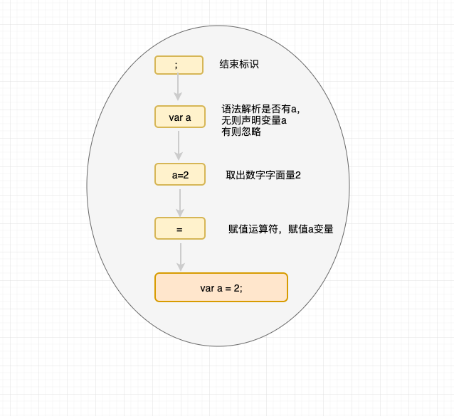

# 这是一些js的思想和底层

##[meta programming 元编程](/src/js/metaProgramming.md)


## 编译

传统的编译一般经历为三个步骤： 
  * 分词/词法分析: 将一连串字符打断成有意义的token片段。如：`var a = 2;`。将拆分成`var`, `a`, `=`, `2`, `;`,空格根据环境决定是否保留作为一个token标识。（语言都会当成字符进行分析）
  * 解析：将token的流数组转为一个嵌套展示程序的语法解构树，抽象语法树（AST —— Abstract Syntax Tree）
  * 代码生成
  ```
      var a = 2;
      /**
      * 第一步 var a
      * 第二部 a = 2 // a <-- 2
      */
  ```

   <br/>
  **[为了更清楚的说明这种编译器模式：先声明标量再赋值,变量提升了，赋值和其他逻辑操作仍保留在原位](./声明提升.md)**严格的说针对当前作用域的提升
  ```
  <!-- examples first-->
  a = 2;
  var a; 
  console.log(a) // 实际输出的是2： 1、var a -->声明提升； 2、 a = 2 --> 赋值  3、console.log(a)

  <!-- exmaples second -->
  console.log(a)
  var a;
  a = 2;
  // output undefined: 1、var a --> 变量提升; 2、console.log(a); 3、 a = 2

  ```

### LHS查询和RHS查询
* LHS(Left-hand Side):变量出现在赋值操作的左手边，即被赋值
* RHS(Right-hadn Side):变量出现在赋值操作的右手边，引用，取
```
<!-- example -->
a = 2 // Lhs
b = a // Lhs:b Rhs: a
function foo(a) {
  console.log(a) // a的Rhs
}

foo(2) // a的Lhs： a = 2
 
```

### 闭包和作用域的妙用

> 思想: 最低权限规则(最少曝光， 最低授权)， 这意味着你只需要暴露最低限度的接口，隐藏你的内部实现过程，组件、插件等设计思想，私有变量

```
<!-- i only need invoke getMoney methods no need to care about the card, the bank -->
function getMoney() {
  function getCard() {
    
  }
  function goBank() {

  }
  getCard()
  goBank()
}

```

> IIFE(Immediately Invoked Function Expression) 立即调用函数 (fn() { 不会污染的作用域})()

```
var name = 'dylan' // global data 
(function log(obj) {
  var a = 1
  console.log(a) // 不污染的局部变量
  console.log(obj.name) // 可传参
})({name: 'd'})

```

> 块作用域与垃圾回收，代码重构
* **首先明确的代码块风格比隐晦或微妙的代码块好，明确的代码块便于模块化和重构以及在其他语言中使用**

```
<!-- examples if的污染外部作用域 -->
// ❎bad 
if(true) {
  var a = 1
}
console.log(a) // if{}块作用域下，由于var的变量提升导致作用于污染

// ✅ good 
<!-- let 关键字将变量声明附着在它所在的任何块儿, 不会有变量提升 -->
if(true) {
  let a = 1 // 生成局部作用域块
}
console.log(a) // ReferenceError

<!-- 明确的块 -->
{
  let name = 'dylan'
  const gender = 'male'
}
```
* 垃圾回收

```
function search(query) {
  // query actions
}
<!-- ❎ ->
let query = { id: '123' }
search(query)
<!-- ✅运行之后即消失,明确的行为可以告知引擎垃圾回收执行时机为块执行结束 -->
{
  let query = { id: '123'}
  search(query)
}

```

**但是现在主流的代码风格已经有了一种共识，块作用域的写法会增加一定阅读性难度**


