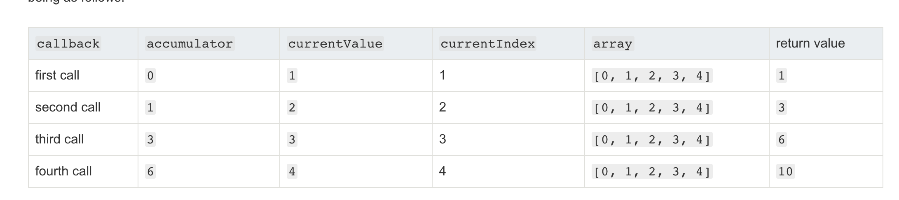
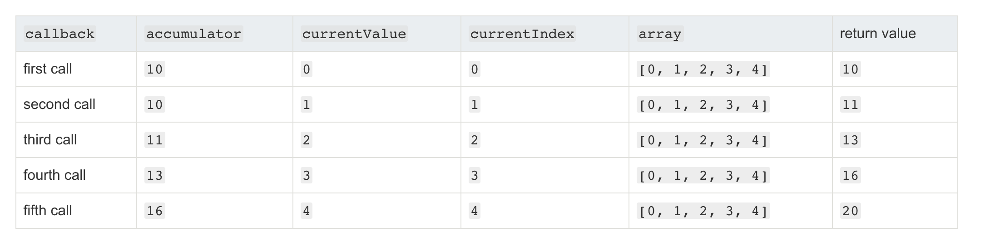

# 定义
根据提供reducer函数进行升序执行，并将结果汇总成一个值返回

# syntax

```
arr.reduce(callback[,initValue])

/**
* @params callback(accumulator, currentValue, currentIndex, array)
*        * accumulator 累加器，累加每次执行的值，若提供initValue则初始为initValue,函数调用 从0开始，否则初始值为数组的第一项，函数从1开始调用
*        * currentValue 当前函数调用的数组当前项
*        * currentIndex 当前函数调用的数组当前下标
*        * array 调用执行的数组
* @params initValue 函数执行的初始值
*         不提供将使用数组的第一个元素作为initValue; 数组为空且未提供初始值，会报错
*/

```
# examples
```
const arr = [1,2,3,4,5]

// 不提供initValue 从下标1开始回调，函数执行 length -1次
arr.reduce((a,b,c,d) => {
  console.log(a,'current:',b,c,d)
  return a + b
})

// 提供initValue, 从下标0开始，函数执行length次
arr.reduce((a,b,c,d) => {
  console.log(a,'current:',b,c,d)
  return a + b
}, 1)


```

**执行顺序**<br/>
* 无初始值执行顺序

* 有初始值执行顺序



# 一些高级函数和polyfill
* flat
```
// here also flat polyfill
if(!Array.prototype.myFlat) {
  function reduceByDepth(arr, depth, step=1) {
    return  arr.reduce((a,b) => {
      return Array.isArray(b) && step < depth ? a.concat(reduceByDepth(b, depth, step + 1)) : a.concat(b)
    },[])
 
  }
  Object.defineProperty(Array.prototype, 'myFlat', {
    value: function(depth = 1) {// set default depth
      const arr = []
      let o = Object(this)
      // 转为正数数字
      let len = this.length >>> 0
      if(len < 1) return arr
      else {
        console.log(reduceByDepth(o,depth))
        return reduceByDepth(o,depth)
      }

    }
  })
}

```

* 引入类型项的操作

```
// 过滤出一个对象status组成的数组

const list =[
  {id:1, status: '00'},
  {id:2, status: '01'},
  {id:3, status: '02'},
  {id:4, status: '01'},
  {id:5, status: '00'},
]

list.reduce((a,b) => a.concat(b.status), [])
// 根据状态分组
let groupStatus = list.reduce((a,b) => {
  if(!a[b.status]) {
    a[b.status] = []
  }
   a[b.status].push(b)
  return a
}, {})


```

* 重复类

```
<!-- 计算重复的次数 -->
const repeatArr = ['dylan', 'kim', 'carle', 'kate', 'dylan', 'kate', 'kim','kim']

let countJson = repeatArr.reduce((a,b) => {
  if(a[b]) {
    a[b]++
  }else {
    a[b] = 1
  }
  return a
}, {})
<!-- 去重 -->
let noRepeat = repeatArr.reduce((a,b) => a.includes(b) ? a : a.concat(b),[])

```
* pipe & compose 
```
// 管道函数 pipe function

const add = (x) => x  + 1
const double = (x) => x * x
const cut = (x) => x - 1

const pipe = (x) => y => x(y)

console.log(pipe(add)(2)) // 3
console.log(pipe(double)(2)) // 4
console.log(pipe(cut)(2)) // 1

const compose = (...args) => input => args.reduce((a,b) => b(a), input )
const addDouble = compose(add, double)
const addCut = compose(add, cut)
const doubleCut = compose(double, cut)
const all = compose(add, double, cut)
console.log(addDouble(2)) // 9 
console.log(addCut(2)) // 2
console.log(doubleCut(2)) // 3
console.log(all(2)) // 8

```
