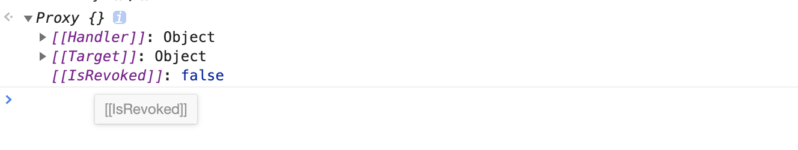
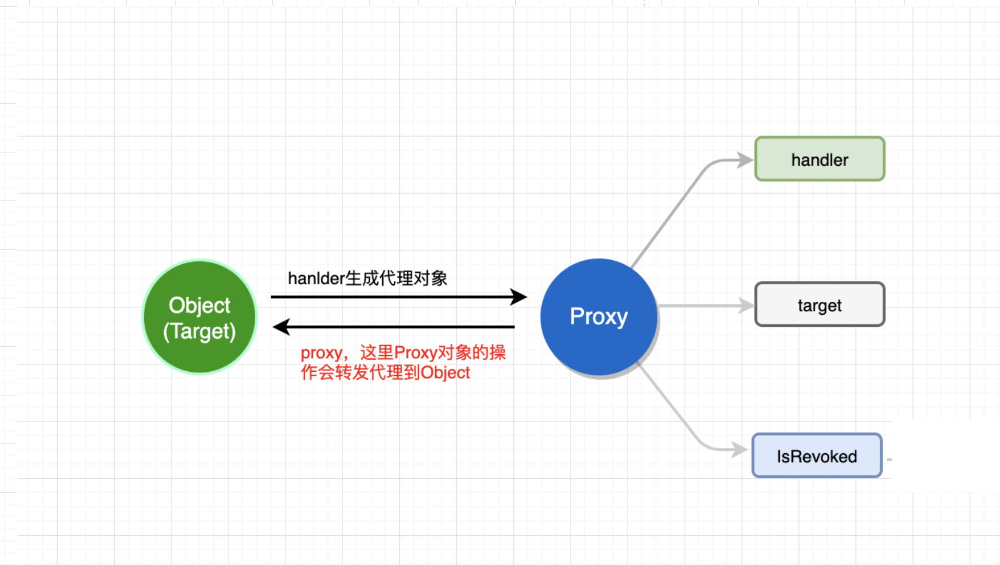

# 定义

> proxy 是js的内置对象, 用于自定义代理对象的基本操作(如属性查找，赋值，枚举，函数调用等)<br/>
> **原则上对象代理后，不要直接在原对象上进行操作，所有操作都应该通过代理完成，保证所有操作都经过handler的trap** ***因为handler的trap并不作用于原对象***
> 提供了js元编程的能力
# Syntax
 
> new Proxy(target, handler)

* target 被代理的对象可以是任何一个原生对象包括一个代理

* handler 一个对象，其属性是定义代理对象的执行操作的函数


# 术语

* handler
   > 陷阱的占位符

* traps
   > 属性访问的方法（拦截操作）,类似操作系统的陷阱

* target
   > 代理的虚拟对象。常用于在后面储存代理对象.根据目标验证关于对象不可扩展性或不可配置属性的不变量（保持不变的语义）

# 原型属性



# methods
[Proxy.revocable(target, handler)](./revocable/Readme.md);


# examples

```
const obj = {
  a: '1',
  b: '2',
  c: '3'
}

let proxy = new Proxy(obj,{
  get: function(target, props){
    // here Object.is(target, obj): true
    return target[props]
  }
})
obj.a = 'a' // 引用类型
proxy.b = 'b' // 操作转发

console.log(proxy.a, obj.a); // a, a
console.log(proxy.b, obj.b); // b, b

```



## handler
 handler的traps不作用于原对象
```
// validate

let dylan = {
  age: 22,
  name: 'dylan'
}

let dylanProxy = new Proxy(dylan, {
  get(target, prop) {
    return target[prop]
  },
    // 拦截代理对象的set
  set(target, prop, value) {
    console.log('proxy setting')
    if(prop === 'age' && !Number.isInteger(value)) {
      throw new Error('age is number')
    }
    target[prop] = value
    return true
  }
})
/**handler的trap并不作用于原对象 */
dylan.age = 'twenty'
console.log( dylan.age) //  'twenty'
console.log( dylanProxy.age) // 'twenty'
dylanProxy.age = 22 // proxy setting 1次
```

* **[hanlder.apply](./apply/Readme.md)**

     函数调用的陷阱
