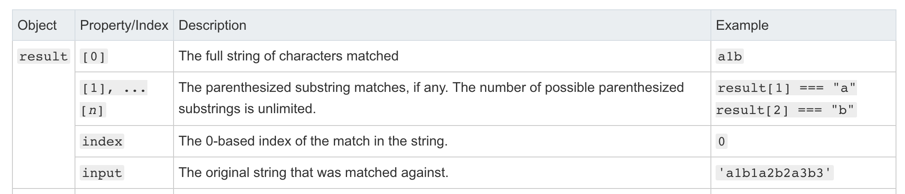

# 定义
`reg.exec(str)`对指定字符串进行正则匹配返回一个数组或者null

# Syntax

> reg.exec(str)

* 返回值：如果匹配成功， `exec()`方法返回一个数组并更新lastIndex（下一次匹配开始的位置,flag 包含g的情况);如果失败，返回null，lastIndex为0


# Examples
```
const reg = /a/
const regG = /a/g
const str = 'a1a2a3'
let a = reg.exec(str) // ["a", index: 0, input: "a1a2a3", groups: undefined]
let a1 = reg.exec(str) // ["a", index: 0, input: "a1a2a3", groups: undefined]
let b = reg.exec('1a2a3a') // ["a", index: 1, input: "1a2a3a", groups: undefined]
let c = regG.exec('a1a2a3') // ["a", index: 0, input: "a1a2a3", groups: undefined]
let d = regG.exec('a1a2a3') // ["a", index: 2, input: "a1a2a3", groups: undefined]

// 分组的情况

const regGroup = /(a)\d+(b)/g

const f = regGroup.exec('a1b1a2b2a3b3') // ["a1b", "a", "b", index: 0, input: "a1b1a2b2a3b3", groups: undefined] 
const g = regGroup.exec('a1b1a2b2a3b3') //  ["a2b", "a", "b", index: 4, input: "a1b1a2b2a3b3", groups: undefined]
```
由此可以总结出result返回结果的数组格式<br/>


理解index和正则本身的关系
下面的代码输出为？

```
// 分组的情况
const str = 'a1b1a2b2a3b3'
const regGroup = /(a)\d+(b)/g

const f = regGroup.exec(str) 
const g = regGroup.exec(str) 

const h = [...str.matchAll(regGroup)]

console.log(h)
```
在控制台运行后输出:`[["a3b", "a", "b", index: 8, input: "a1b1a2b2a3b3", groups: undefined]]`，分解一边代码

```
const str = 'a1b1a2b2a3b3'
const regGroup = /(a)\d+(b)/g
/**
* --> regGroup index = 3，下一次执行正则相关捕获操作将从下标3开始，包含如下
* 正则操作：String.prototype.matchAll, RegExp.prototype.exec
*/
const f = regGroup.exec(str) // ["a1b", "a", "b", index: 0, input: "a1b1a2b2a3b3", groups: undefined]  

//regGroup index = 7，下一次执行正则相关捕获操作将从下标7开始，
const g = regGroup.exec(str) //  ["a2b", "a", "b", index: 4, input: "a1b1a2b2a3b3", groups: undefined]


const h = [...str.matchAll(regGroup)] //[["a3b", "a", "b", index: 8, input: "a1b1a2b2a3b3", groups: undefined]]


```


