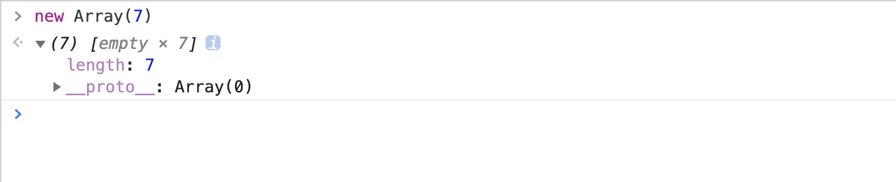

### 万古不变的map定义
`map()`会通过回掉函数创建一个新的数组，不改变原数组，语法糖如下：

```
// copy from mdn https://developer.mozilla.org/en-US/docs/Web/JavaScript/Reference/Global_Objects/Array/map
var new_array = arr.map(function callback(currentValue[, index[, array]]) {
    // Return element for new_array
}[, thisArg])
// callback array 代表的是当前的执行map的源数组

```
以下场景map输出是啥
```
new Array(7).map(i => console.log(i))
console.log(Array(7).map((i, index) => index));
const arr = [ { id: 1, name: 'first' }, { id: 2, name: 'second' } ]
arr.map((i, index) => {
  i.name = i.id + '-' + index
  return i
})
console.log(arr)
```
我们控制台输出会看到第一步没有输出，第二部输出`[empty × 7]`，第三步输出`[ { id: 1, name: '1-0' }, { id: 2, name: '2-1'} ]`
查询资料，关于`map callback`资料上有这么一句话：
> It is not called for missing elements of the array (that is, indexes that have never been set, which have been deleted or which have never been assigned a value).
未声明的数组项`map`方法的`callback`将不执行。
* `non-assigned`
第一步`new Array(7).map(i => console.log(i))` 没有输出，我们控制台中输出`new Array(7)`<br/>
 <br/>
可以发现这是一个没有初始下标的数组，index`0,1,2,3,4,5,6`都是未初始化、未声明的状态，
```
const arr = new Array(7)
console.log(arr[0]) ---> undefined
console.log(arr) ---> [empty x 7]
```
是得到是默认值，只要没有进行`set`赋值操作，这里数组项一直都是未初始化。
* `deleted`
```
const arr = [1, 2, 3]
delete arr[1] // arr --> [1, empty, 3]
```
运行上面的代码我们发现`delete`操作将会使数组项`empty`，所以无论是未声明还是被删除都是数组项进入一个`empty`态。

* `array element empty` 状态
> 四种empty的情况
```
// how to get a empty element
const arr = new Array(3) // [empty x 3]
const arr = [1,2,3]
delete arr[0] // [ 1, empty, 3 ]
const arr = [1, , 3] // [ 1, empty, 3 ]
// anthor empty statement
const arr = [ 1, 2, 3 ]
arr[4] // empty
```
> 对数组的影响
```
const arr = [1, 2, 3]
delete arr[1] // arr --> [1, empty, 3] array get empty element
arr.map(i => console.log(i)) //  1、3
arr.forEach( i => console.log(i)) //  1、3
arr.filter( i => console.log(i)) //  1、3
arr.reduce( (a,b) => { console.log(a,b); return a  }) // 1、3
```

> 如何正常化
```
<!-- empty状态是未赋值的一种状态 -->
[...new Array(7)].map((i) => console.log(i))]
```

### 官方的定义`map`不改变原数组

```
const arr = [ { id: 1, name: 'first' }, { id: 2, name: 'second' } ]
arr.map((i, index) => {
  i.name = i.id + '-' + index
  return i
})
console.log(arr)
```
这里的涉及到的就是引用类型的知识点，不改变原数组引用类型的指针，但是指针指向的内存发生了改变。个人习惯上，经常用`map`来处理接口的消费数据列表，这里曾经跟同事有过讨论，他的观点是官方提供了其他api来操作数组项，不应该使用`map()`，这是一种不规范的api使用(参考设计的单一原则)，我觉得各有各的道理，不过写法上我觉得`map`更方便优雅些