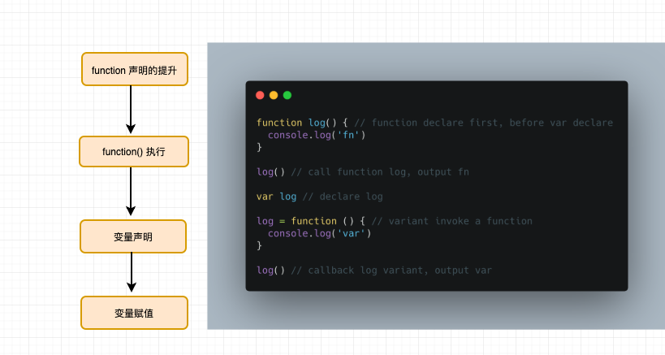

### 提升
  ```
  <!-- examples first-->
  a = 2;
  var a; 
  console.log(a) // 实际输出的是2： 1、var a -->声明提升； 2、 a = 2 --> 赋值  3、console.log(a)

  <!-- exmaples second -->
  console.log(a)
  var a;
  a = 2;
  // output undefined: 1、var a --> 变量提升; 2、console.log(a); 3、 a = 2

  ```

上面有一个很好的变量编译和变量提升的解释 这里我们再深入聊一下提升这个概念
1、提升是相当于当前作用域的提升，也可以说提升是绑定作用域的
```
/**
* 1、improve function内部 var name 
* 2、console.log(name)
* 3、name = 'improve fn'
*/
improve() 
function improve() {
  console.log(name) // undefined
  var name = 'improve fn'
}
console.log(name) // ReferenceError

```
上面的例子我们可以看到函数声明也会进行提升，这也是improve()可执行的原因，但是函数表达式不会

```
improve() // TypeError 其实就是另类的变量提升

var improve = function () {}


improve1() // TypeError

improve2() // ReferenceError

var improve1 = function improve2() {
 
}

==》》 var a = function() {
  var b = ...self...
}
```
这里涉及到函数的内部一个知识点
```
var i = function name() {
  name = 'Dylan'
  console.log(name) // [Function: name]
  console.log(name === i) // true 地址跟地址的比较
}
console.log(name)  // ReferenceError
```
上面的代码开始`function name()`内部name未声明的情况默认为function本身,不可更改，输出值为`[Function: name]`, 此时的`name`是一个指针，不是一个变量，外部输出所以报错

函数和变量提升的顺序，函数和变量都会提升，前后是如何的顺序呢，稍微测试我们可以发现函数声明优先提升，然后是变量,
我们用一个图解释下

```
<!-- example 1 -->
logName() // fn 
function logName() {
 console.log('fn')
}
var logName = function () {
  console.log('var')   
}
logName() // var 
<!-- example 2 -->
log() // fn 
var log = function() { console.log('var') }
function log() { console.log('fn') }
log() // var
```
<br/>

一个有趣的现象是跟变量提升一样循环和条件判断中的变量提升仍会暴露在他外面一层, 这种行为是一个待解决的错误❌

```
for(var i = 1; i < 10; i ++) {
  console.log(i) // 1,2,3,4,5,6,7,8,9
}
console.log(i) // 10
var a = true
if(a) {
    function log() {
        console.log('a')
    }
}else {
    function log() {
        console.log('undefined')
    }
}
log() // a
```

我们尝试用let 来更改循环
```

for(let i = 1; i < 10; i ++) {
  console.log(i) // 1,2,3,4,5,6,7,8,9
}
console.log(i) // ReferenceError

————————》》》》》
{
  let j
  for(var i = 1; i < 10; i ++) {
    j = i
    console.log(i)
  }
}

```
let/const 不存在变量提升，具有吸附强化块作用域的作用


